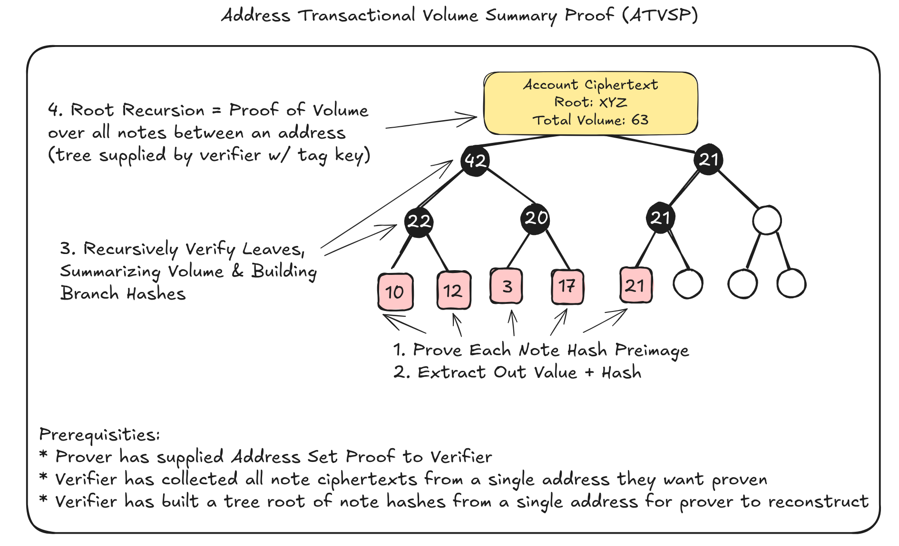

# Aztec Selective Disclosure PoC - Account Transactional Volume Summary Proof (ATVSP)

Using AIP20 notes, prove you never received more that 10,000 tokens in a transaction, and the total amount you received, without any changes to contracts or revealing anything other than the # of notes you had

Note: this scheme cannot work with outbound notes since the OVSK is unimplemented

## Writeup
See [the exploratory writeup](https://hackmd.io/bVRw0Rc4TNOFy2Kfcppe3A#Diagrammed-Volume-Proof) for a general explanation - kinda out of date

## Demo Flow

#### Onchain
*Actual activity that happens organically onchain - nothing special here*

1. Create a token contract
2. Mint tokens to test accounts
3. Make some transfers for the client to prove

#### Auditor Disclosure Setup
*Client self-attests addresses they want to report (would need address set proofs at contract level to constrain)*

4. Client retrieves all tagging keys shared secrets they want to report to auditor from their wallet - leaks the number of tx's with some (still anonymous) address
5. Auditor retrieves all ciphertexts associated with a tagging key in the timespan they want client to prove over
6. Auditor constructs a binary IMT of all the ciphertexts they want included in the ATVSP and delivers to client (with ciphertexts as well for ease of use)

#### Proving
*Client creates the ATVSP*

7. Client creates individual proofs that they know the preimage of each UintNote ciphertext, that the volume was never > 10,0000, and exports the sum and hash of the ciphertext as public outputs ([individual_note circuit](./circuits/individual_note/src/main.nr))
8. Client recurses over individual note proofs to aggregate and hide summation while proving inclusion by reconstructing the ciphertext tree given by the auditor ([note_summary_tree circuit](./circuits/note_summary_tree/src/main.nr))
9. Client reuses the summary tree at higher levels, aggregating 2->1 proofs until a final, single proof is reached - this is the ATVSP!

#### Result
*Selective Disclosure Achieved*

10. Client delivers ATVSP to Auditor
11. Auditor validates the ATVSP
12. Client selectively disclosed to the auditor (for a given contract and sender) the total volume they received, and that no single transaction was over 10,000 tokens. This is done by only additionally leaking the number of transactions done with the given counterparty (which the auditor could maliciously monitor presence of new notes in the future)

## Installation
Note: BEFORE RUNNING YOU NEED A FORK OF AZTEC-PACKAGES
### Aztec Packages Fork
```console
git clone https://github.com/jp4g/aztec-packages-note-discovery && cd aztec-packages-note-discovery
git checkout tagging-export
./build-images/run.sh
# in the dev container that opens
./bootstrap.sh
```
### Running
Runs on `aztec:v3.0.0-devnet.patch-6` and `nargo:1.0.0-beta.18`
Uses yarn and bun (yarn needed for local imports, would be removed if this shipped into main or will remove bun but its hacky)
```console
# 1. clone repo
git clone https://github.com/aztec-pioneers/aztec-atvs-proof && cd aztec-atvs-proof
# 2. install the deps, get gitmodule deps, build the token contract artifact/ interface, and build circuit artifacts
yarn install
# 3. IN A NEW TERMINAL start a local devnet
aztec start --local-network
# 4. run the e2e demo test
bun test test/e2e.test.ts
```